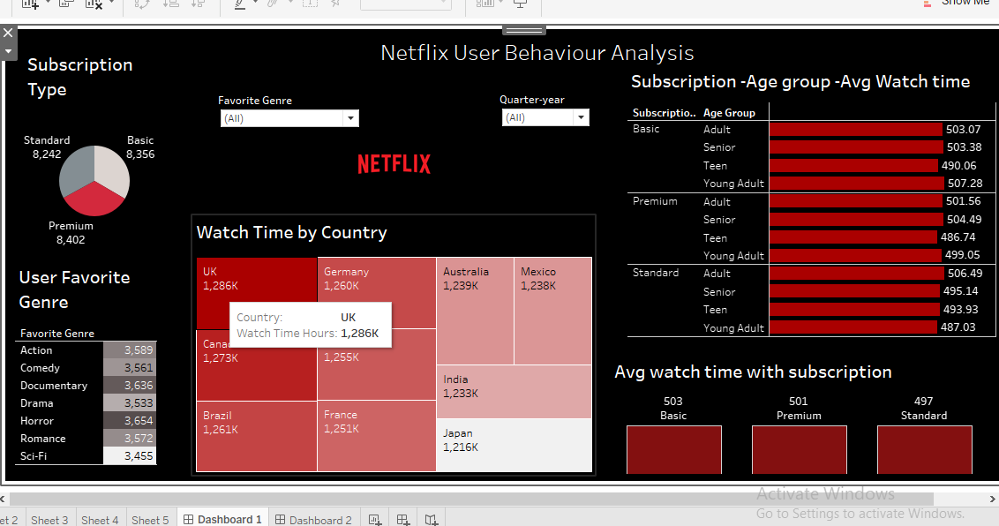
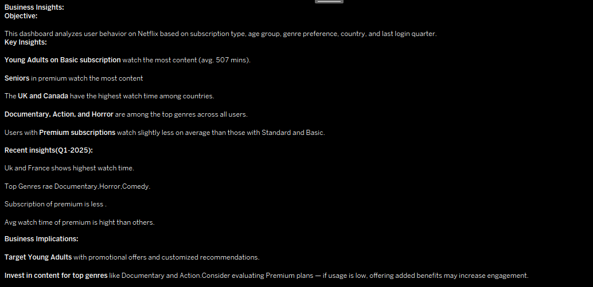

# 📊 Netflix User Behaviour Analysis – Tableau Dashboard

## 🧠 Objective
This project aims to analyze user behavior on Netflix using Tableau, based on:
- Subscription type (Basic, Standard, Premium)
- Age group
- Genre preference
- Country
- Last login quarter

The goal is to uncover key patterns and derive actionable business insights that Netflix could use for marketing, content planning, and user engagement strategies.

## 📌 Key Insights

- 🎯 **Young Adults on Basic subscriptions** watch the most content (avg. **507 mins**).
- 🎞️ **Documentary, Action, and Horror** are among the most preferred genres across users.
- 🌍 **UK and Canada** show the highest total watch time among all countries.
- 👴 **Seniors with Premium subscriptions** have the highest average watch time.
- 📉 **Premium users** watch slightly less on average compared to Basic and Standard users.

## 🔍 Recent Trends (Q1 - 2025)

- **UK and France** topped in total watch time.
- **Top Genres**: Documentary, Horror, Comedy.
- Premium subscription usage is relatively lower.
- Average watch time on **Premium plans** is less than Basic or Standard.

## 💼 Business Implications

- 🎯 **Target Young Adults** with promotional offers and personalized content recommendations.
- 📈 **Invest in top-performing genres** like Documentary and Action.
- 🔄 **Evaluate Premium plans**: If engagement is low, consider adding features or benefits to increase value

## 📷 Screenshots

### Dashboard Overview  

### Insights Panel  

